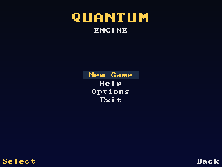
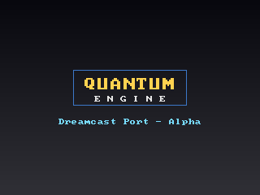

# Quantum Engine — Dreamcast Port (Alpha)

Port do **Quantum Engine** (engine J2ME de Roman Lahin, ~35k linhas em Java)
para o **Sega Dreamcast** usando **KallistiOS**. Esta é a primeira versão
**alpha**: cobre o boot, o pipeline de vídeo (renderização por software
exibida via PVR), fonte bitmap, leitura de recursos, timing do loop, input
do controle e o fluxo de telas **Splash → Menu → (placeholder)**.

O gameplay 3D (rasterizador, IA, colisão, carregamento de mapas) ainda
**não** está conectado — é o próximo passo. O objetivo desta alpha é ter
uma base sólida, compilável e rodável no Flycast, com a mesma arquitetura
de telas/recursos do engine original.




> As imagens acima são o output real do renderizador (geradas por um teste
> de host que reusa as mesmas funções `cv_*`/`font_*` do port).

---

## O que já funciona nesta alpha

| Subsistema | Original (Java) | Port (C/KOS) | Status |
|---|---|---|---|
| Ciclo de vida / boot | `Main` (MIDlet) | `main.c` | ✅ |
| Superfície de vídeo | `MainCanvas`/`MyCanvas` | `render/framebuffer.c` (PVR staging) | ✅ |
| Canvas de software ARGB | `RawImage` (int[]) | `Canvas` + API 2D `cv_*` | ✅ |
| Fonte | `HUD/Base/Font` (PNG) | `render/font.c` (8x8 embutida) | ✅ (alpha) |
| Config | `utils/IniFile` | `config/inifile.c` | ✅ |
| Recursos `/res` | `getResourceAsStream` | `core/res.c` (romdisk `/rd`) | ✅ |
| Timing | `utils/FPS`+`QFPS` | `core/qfps.c` | ✅ (com clamp crítico) |
| Input | `HUD/Base/GameKeyboard` | `core/input.c` (controle DC) | ✅ |
| Telas | `MyCanvas`/`GUIScreen` | `screens/screen.c` (vtable) | ✅ |
| Splash | `HUD/SplashScreen` | `screens/splash.c` | ✅ |
| Menu | `HUD/Menu`+`Selectable`+`ItemList` | `screens/menu.c` | ✅ |
| Rasterizador 3D | `Rendering/Texturing*` | — | ⏳ próximo |
| IA / Colisão / Mapas | `AI/`, `Collision/`, `Gameplay/Map/` | — | ⏳ próximo |

---

## Estrutura

```
QuantumEngine-DC/
├── Makefile                  Build KallistiOS
├── res/                      *** Arquivos internos do jogo (edite aqui) ***
│   ├── setting.txt           config global (= /setting.txt)
│   ├── font.txt              config de fonte (stub no alpha)
│   └── languages/
│       ├── languages.txt
│       └── english.txt       strings de interface
├── romdisk/                  Gerado do res/ no build (vira /rd no DC)
├── src/
│   ├── main.c                boot + loop principal
│   ├── game.c/.h             estado global (= statics de Main)
│   ├── qe_types.h            tipos/cores/anchors/teclas
│   ├── core/
│   │   ├── logger.*          log (aparece no log do Flycast)
│   │   ├── qfps.*            timing (clamp frameTime<0 -> 0)
│   │   ├── res.*             recursos: "/x" -> "/rd/x"
│   │   └── input.*           controle DC -> teclas do engine
│   ├── config/
│   │   └── inifile.*         parser chave=valor (= IniFile)
│   ├── render/
│   │   ├── framebuffer.*     canvas ARGB -> PVR -> tela 640x480
│   │   └── font.*            fonte bitmap 8x8 + drawString/anchors
│   └── screens/
│       ├── screen.h          base (vtable) + ScreenManager
│       ├── screenmgr.c
│       ├── splash.c          SplashScreen
│       ├── menu.c            Menu principal
│       └── notimpl.c         placeholder "em breve"
├── tools/
│   └── make_cdi.sh           gera .cdi (mkdcdisc ou fluxo clássico)
├── tests/                    teste de host da renderização (opcional)
└── docs/
    ├── BUILD_WSL.md          *** guia passo a passo (Ubuntu/WSL) ***
    └── preview/              prints do menu/splash
```

---

## A pasta `res/` (igual ao Eclipse)

Funciona **exatamente** como o classpath de recursos do projeto Eclipse:
um caminho que começa em `/` é resolvido dentro do romdisk montado em `/rd`.

```
Eclipse:   getResourceAsStream("/setting.txt")
Dreamcast: res/setting.txt  →  romdisk  →  /rd/setting.txt
```

Edite os arquivos do jogo em `res/`. O `make` reempacota automaticamente
(`res/` → `romdisk/` → imagem embutida no `.elf`).

---

## Como compilar (resumo)

Pré-requisito: ambiente KallistiOS instalado e carregado.

```bash
source /opt/toolchains/dc/kos/environ.sh   # carrega o ambiente KOS
cd QuantumEngine-DC
make            # gera quantum.elf
make cdi        # gera quantum.cdi (para o Flycast)
```

Rodar no Flycast:

```bash
flycast quantum.cdi
```

O guia completo (instalação do KOS no Ubuntu/WSL, mkdcdisc, Flycast,
captura de log) está em **`docs/BUILD_WSL.md`**.

---

## Controles (alpha)

| Dreamcast | Ação (engine) |
|---|---|
| D-pad / analógico | navegar no menu (onKey2/4/6/8) |
| A | selecionar (onKey5 / soft-left) |
| B | voltar (soft-right) |
| START | voltar / pausa |

---

## Decisões de port relevantes

- **Timing (`qfps.c`)**: o clamp é `frameTime < 0 → 0` (e **não** `< 1 → 1`).
  O clamp `< 1 → 1` fazia o relógio interno adiantar em relação ao tempo
  real (bug de agressão da IA no track M3G). Preservado aqui.
- **Vídeo**: o canvas de software 320×240 (proporção "de celular") é
  escalado 2× por hardware pelo PVR para 640×480, via uma textura de
  staging potência-de-dois (512×256, RGB565). Sem filtro (nearest),
  mantendo o visual do engine original.
- **Fonte**: no alpha usamos uma fonte 8×8 embutida em C. A API pública
  (`font_draw` com anchors, `font_width_of`, `font_height`) espelha
  `Font.java`, então trocar por um loader de PNG depois não muda as telas.
- **Ângulos / matemática**: quando o rasterizador for portado, seguir os
  aprendizados já documentados (graus inteiros 0–359, floats nativos no
  FPU do SH-4 em vez de ponto-fixo).

---

## Próximos passos sugeridos

1. Loader de imagens (PNG/QCT) para fontes e sprites reais.
2. Portar `Math` (Vector3D/Matrix/MathUtils) → base para o 3D.
3. Portar o rasterizador (`Rendering/Texturing*`) sobre o `Canvas`.
4. Carregamento de mapas (`LevelLoader`/`Scene`/`House`).
5. IA/colisão (`AI/`, `Collision/`).

Plano de conversão faseado: **Math → Rendering core → Meshes/Sprites →
utils/Main → Map/Gameplay → AI/Collision → HUD**.
